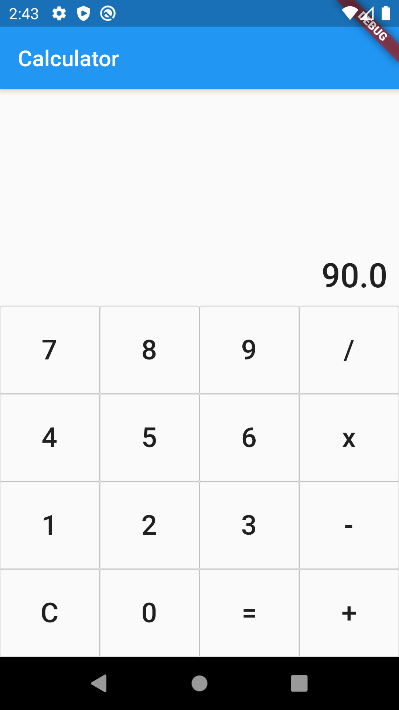

# Calculator - flutter project

A simgple caltulator, built on flutter.

## Instructuions

This is a flutter project, so there should be whatever you need to run the flutter project. Then after clone the project should do what to do,
(এটা একটি ফ্লাটার প্রজেক্ট, তাই ফ্লাটার প্রজেক্ট রান করতে যা কিছু প্রয়োজন সেগুলো থাকতে হবে। এরপর প্রজেক্টটি clone করার পর যা করতে হবে)

<ul>
    <li>1. flutter clean</li>
    <li>2. flutter pub get</li>
    <li>3. flutter run</li>
</ul>

## App version

1.0.0 (May be 15-March-2020)

## Requires Android

Requirement of Minimum SDK Version: minSdkVersion 16 (Android 4.1 or, JELLY BEAN)

## Tested On:

Emulator

## Used tools and programming languages

<ul>
    <li>Flutter: Stable v1.12.13+hotfix.5 (Flutter released: 10th December 2019)</li>
    <li>Dart 2.7.0</li>
    <li>Android SDK version 29.0.2, Android API level 29 or, Android 10.</li>
</ul>

### App size:

15.2 MB (After build on APK for all platform)  
5.6 MB (After build on APK for specific platform)

### Developed by:

Md. Rezwan Saki Alin
https://www.alinsworld.com/
